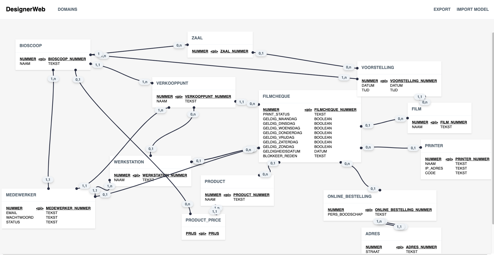
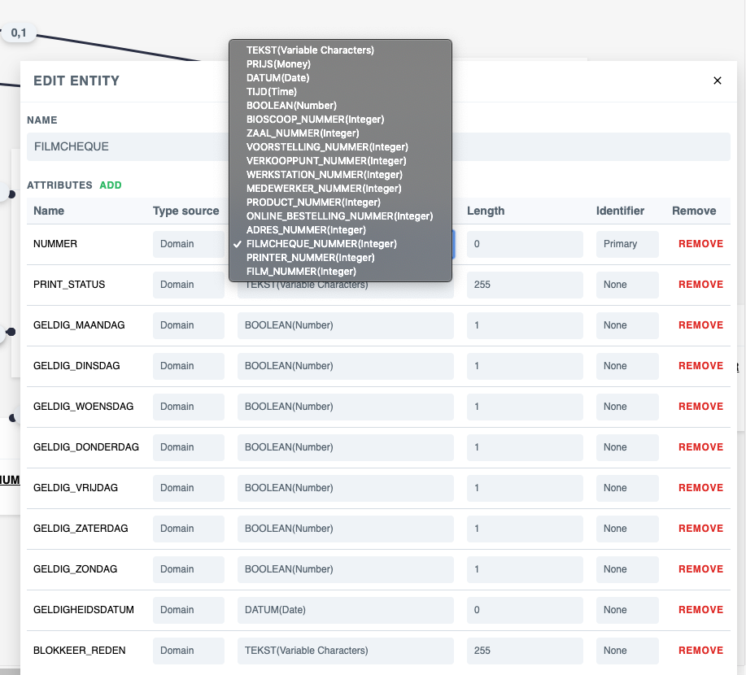
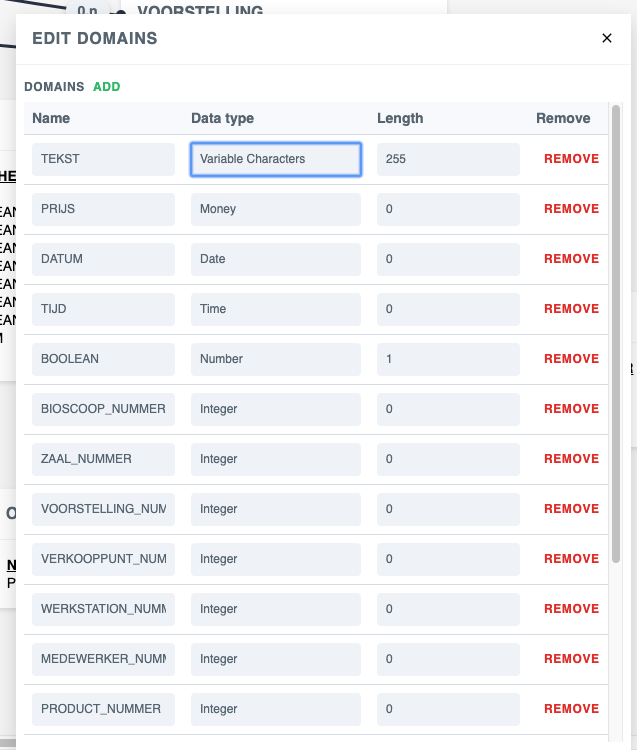

# Designer Viewer
Parses common diagram formats and displays the web-version.

## Demo
[View it online](https://cdm.maartendev.me)
##### Overview

##### Attribute Editing

##### Domain Editing

## Features
- View existing model
- View attributes of entities
- Add/Update/Remove entity attributes
- View relations(with multiplicity and name)
- View domains
- Add/Update/Remove domains

## Feature Requests
| Description               | Priority      | Status             |
| --------------------------| ------------- | -------------------|
| Create Entities           | Must Have     |  Working on it     |
| View relation details     | Must Have     |  planned, ~2 days  |
| Update relation details   | Must Have     |  planned, ~2 days  |
| Implement saving entities to persistent model | Should Have    |  not planned, ~1 week |
| Implement scaling to diagram viewer   | Nice to have    |  not planned, ~1 week |
