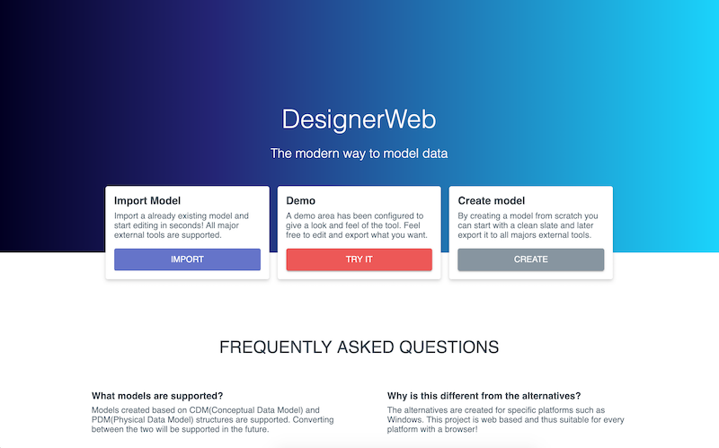
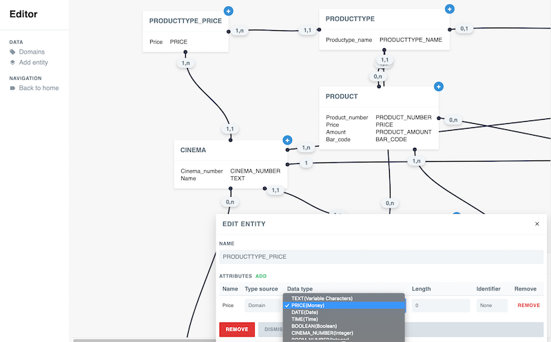

# Designer Viewer
Parses common diagram formats and displays the web-version.

## Demo
[Try it online](https://maartengdev.github.io/designer-web)
### Landing

### Editor

## Features
| Description               |  View  | Create | Update | Remove |
| --------------------------| ------ |------  | ------ | ------ |
| Entities                  | ✅     | ✅     |✅       | ✅     |
| Relations                 | ✅     | ✅     |✅       | ✅     |
| Domains                   | ✅     | ✅     |✅       | ✅     |

## Feature Requests
| Description               | Priority      | Status             |
| --------------------------| ------------- | -------------------|
| Implement scaling to diagram viewer   | Nice to have    |  not planned, ~1 week |
